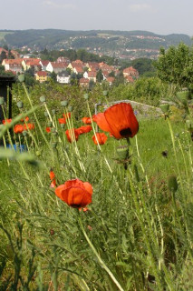
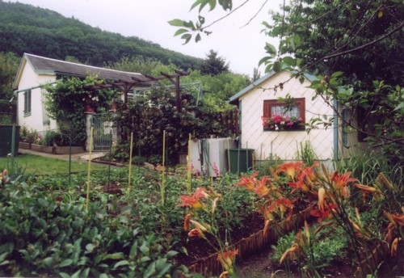

Die Kleingartenanlage "Zur Hoffnung" wurde am 20.Oktober 1946 gegründet. 

Es sind 130 Parzellen vorhanden.

In unserem Vorstand arbeiten 9 Gartenfreundinnen und Gartenfreunde mit.

Kulturelle Veranstaltungen organisiert der Club in Abstimmung mit dem Vorstand und dem Heimbeirat.

Unser Vereinshaus vermieten wir gern zu annehmbaren Preisen.

Siehe im Link "Vereinshaus"

Es bietet Platz, je nach Bestuhlung, für maximal 80 Personen,

Für Versammlungen, Veranstaltungen und private Feiern unserer Pächter und der Gäste.

 